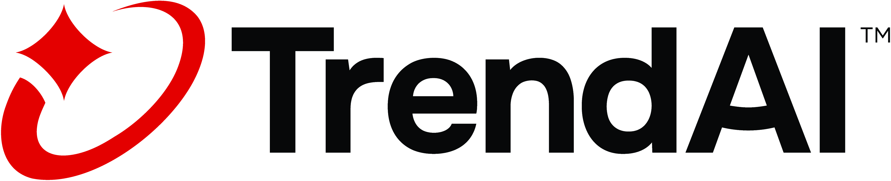

# TMAS Scan Action



## Scan your containers with [Vision One Container Security](https://www.trendmicro.com/en_in/business/products/hybrid-cloud/cloud-one-container-image-security.html)

This tool is meant to be used as a [GitHub Action](https://github.com/features/actions).

## Requirements

* Have an [Vision One Account](https://signin.v1.trendmicro.com/). [Sign up for free trial now](www.trendmicro.com/en_us/business/products/trials.html?modal=s1b-hero-vision-one-free-trial-c022c8#detection-response) if it's not already the case!
* [A Vision One API Key](https://automation.trendmicro.com/xdr/Guides/First-Steps-Toward-Using-the-APIs) with a custom role that contains the permission `Run artifact scan`.
* A Vision One Region of choice (ap-southeast-2, eu-central-1, ap-south-1, ap-northeast-1, ap-southeast-1, us-east-1) 
* A container image to be scan.

## Usage

Add an Action in your `.github/workflow` yml file to scan your image with Vision One Container Security.

```yml
- name: Vision One Container Security Scan Action
  uses: trendmicro/tmas-scan-action@version*
   with:
      # Mandatory
      TMAS_API_KEY: ${{ secrets.TMAS_API_KEY }}
      REGION: us-east-1
      VULNERABILITY_SCAN: true
      # Optional
      SBOM: true # Saves SBOM to SBOM.json so you can export it as an artifact later.
      MALWARE_SCAN: true # Enable malware scan.
      SECRETS_SCAN: true # Enable secrets scan.
      IMAGE: alpine # The image need to be public or the pipeline need to have access to the private image of choice.
      LOCAL_IMAGE_TARBALL: image.tar
      # For each threshold below, select the maximum number of vulnerabilities that are acceptable.
      MAX_TOTAL: 0
      MAX_CRITICAL: 0
      MAX_HIGH: 0
      MAX_MEDIUM: 0
      MAX_LOW: 0
      MAX_NEGLIGIBLE: 0
      MAX_UNKNOWN: 0
      SCAN_RESULT_ARTIFACT: result.json # Save as an artifact in GitHub to be able to keep the result of the scan.
```

## Artifacts (Optional)

Artifacts allow you to share data between jobs in a workflow and store data once that workflow has completed, in this case saving the scan result and the container image SBOM as an artifact allow you to have proof on what happened on past scans. In the example below, you can add an extra action after the scan to keep the result the scan as an artifact for 30 days:

```yaml
  - name: 'Upload Scan Result Artifact'
    uses: actions/upload-artifact@v3
    with:
      name: scan-result
      path: result.json
      retention-days: 30
  - name: 'Upload SBOM Artifact'
    uses: actions/upload-artifact@v3
    with:
      name: sbom
      path: SBOM.json
      retention-days: 30
```

**Note**: By default, GitHub stores build logs and artifacts for 90 days, and this retention period can be customized. For more information, check the [GitHub Documentation](https://docs.github.com/en/actions/using-workflows/storing-workflow-data-as-artifacts).

## Contributing

If you encounter a bug, think of a useful feature, or find something confusing in the docs, please [create a new issue](https://github.com/trendmicro/tmas-scan-action/issues/new)!

We :heart: pull requests. If you'd like to fix a bug, contribute to a feature or just correct a typo, please feel free to do so.

If you're thinking of adding a new feature, consider opening an issue first to discuss it to ensure it aligns to the direction of the project (and potentially save yourself some time!).

## Support

Official support from Trend Micro is not available. Individual contributors may be Trend Micro employees, but are not official support.
