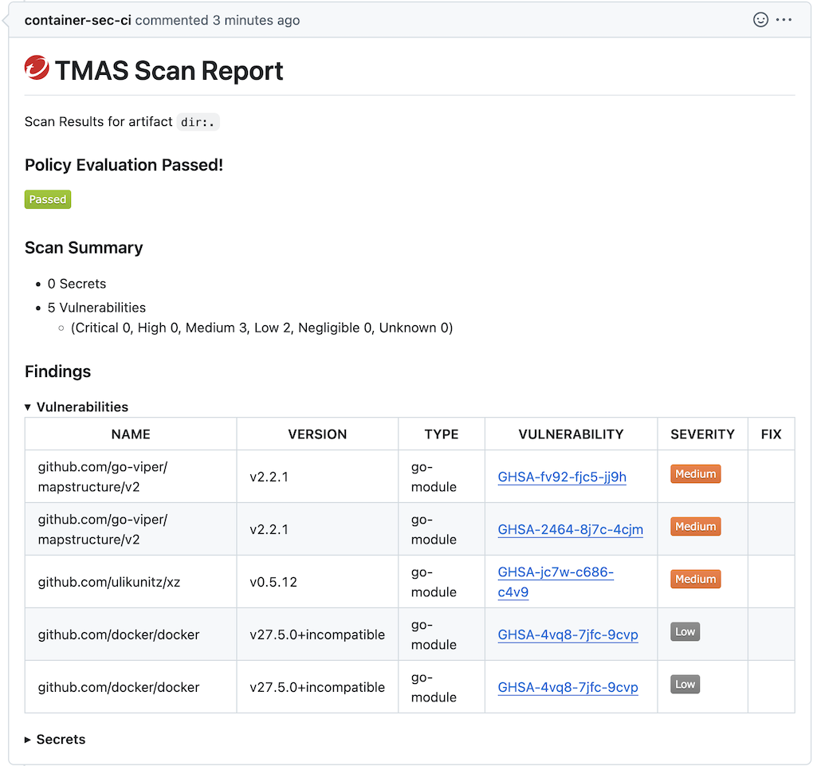

# TMAS Scan Action


Scan artifacts in your workspace for open-source vulnerabilities, malware, or secrets using [TMAS (Trend Micro Artifact Scanner)](https://docs.trendmicro.com/en-us/documentation/article/trend-vision-one-__artifact-scanner-tmas-2).

## About

This [GitHub Action](https://github.com/features/actions) installs a specified version of the TMAS CLI tool on the GitHub Actions runner and scans a specified artifact for open-source vulnerabilities, secrets, or malware.

The complete scan findings are displayed in the action logs, and a summary report will be posted as a comment on any related PRs.

## Requirements

- Have a [Vision One Account](https://signin.v1.trendmicro.com/). [Sign up now](https://account.trendmicro.com) if you don't already have one.
- [A Vision One API Key](https://docs.trendmicro.com/en-us/documentation/article/trend-vision-one-__obtaining-api-key-2).
- Determine your Vision One region (`us-east-1`, `eu-central-1`, `ap-southeast-2`, `ap-south-1`, `ap-northeast-1`, `ap-southeast-1`, `me-central-1`).

## Usage

Add an action in your `.github/workflows` YAML file to scan your artifact with TMAS. TMAS can scan files, directories, and container images from a wide variety of sources. See the [artifact documentation](https://docs.trendmicro.com/en-us/documentation/article/trend-vision-one-__artifact-scanner-cli-2#GUID-09957805-70E7-401F-A691-F587FCE2CB8B-ofd60h__supportedArtifacts) for more details.

### Scan a GitHub repository

```yaml
name: TMAS Scan

on:
  push:

jobs:
  tmas-scan:
    name: TMAS Repo Scan
    runs-on: ubuntu-22.04
    steps:
      - name: Checkout
        uses: actions/checkout@v4
        with:
          path: repo-name

      - name: Download TMAS and Scan Repo for Open Source Vulnerabilities and Secrets
        uses: trendmicro/tmas-scan-action@vX
        with:
          version: '2' # Recommended: pin to major version for automatic updates within v2.x.x
          vulnerabilitiesScan: true
          malwareScan: false
          secretsScan: true
          artifact: dir:./repo-name
          additionalArgs: --region=eu-central-1
          tmasApiKey: ${{ secrets.TMAS_API_KEY }}
          githubToken: ${{ secrets.GITHUB_TOKEN }}
```

### Scan a build artifact

```yaml
name: TMAS Scan

on:
  pull_request:

jobs:
  tmas-scan:
    name: TMAS Container Scan
    runs-on: ubuntu-22.04
    steps:
      - name: Download TMAS and scan container for Open Source Vulnerabilities, Malware and Secrets
        uses: trendmicro/tmas-scan-action@vX
        with:
          version: X.X.X
          vulnerabilitiesScan: true
          malwareScan: true
          secretsScan: true
          artifact: registry:my-registry/my-app:latest
          additionalArgs: --region=eu-central-1
          tmasApiKey: ${{ secrets.TMAS_API_KEY }}
          githubToken: ${{ secrets.GITHUB_TOKEN }}
```

## Inputs

The action's supported inputs and outputs are described in the [action definition file](action.yml).

## Runner Prerequisites

The TMAS scan action requires the following tools to be installed on the GitHub Actions runner:

- `curl`
- `jq`

## Results

- A summary of the TMAS scan results is posted as a comment on related PRs.
- The complete findings of the scan can be found in the action logs under `TMAS Scan Report`.



### GitHub Permissions

To post the scan summary comments a GitHub token must be provided to the action. In most cases the default action token `secrets.GITHUB_TOKEN` will be sufficient. However if this default token is restricted to read-only, additional permissions will need to be specified in the workflow as shown, or a personal access token used instead.

```yaml
name: TMAS Scan

on:
  pull_request:

permissions:
  contents: read
  pull-requests: write
```

## Policy Evaluation

You can add a policy with [Vision One Code Security](https://docs.trendmicro.com/en-us/documentation/article/trend-vision-one-code-security-intro) which will fail the tmas-scan-action if the scan results don't meet expected policy standards. When this workflow is marked as required in GitHub, this can be used to block pull request merges until such issues are addressed.

## Contributing

If you encounter a bug, think of a useful feature, or find something confusing in the docs, please [create a new issue](CONTRIBUTING.md)!